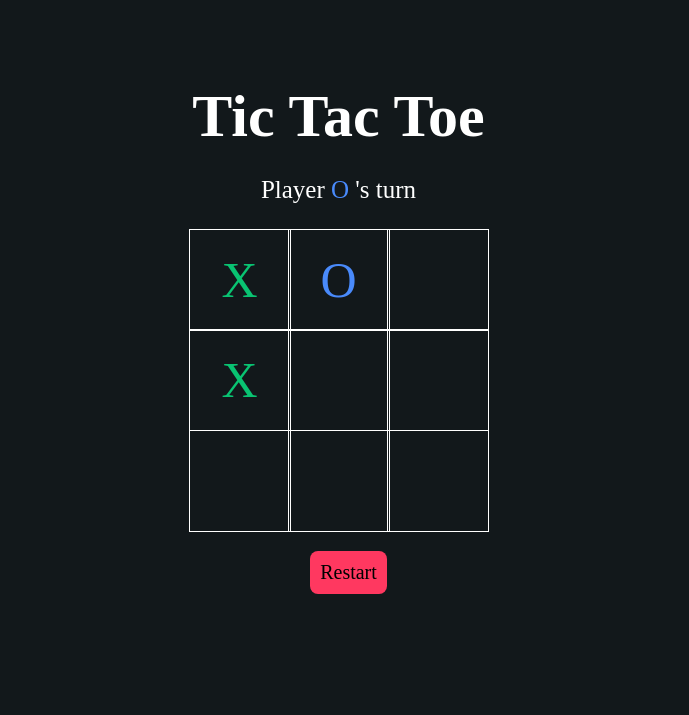

# Tic Tac Toe

> A simple Tic Tac Toe game 

[Live demo](https://samirm00.github.io/tic-tac-toe/)

## Table of contents

- [General info](#general-info)
- [Screenshots](#screenshots)
- [Technologies](#technologies)
- [Setup](#setup)
- [Features](#features)
- [Status](#status)

## General info

> A simple Tic Tac Toe using HTML,CSS and Vanilla JavaScript.

## Screenshots



## Technologies

- HTML 5
- CSS 3
- JavaScript
- VS code


## Setup

- `clone the repo or fork it`

## Code Examples

```js

function handleResultValidation() {
    let roundWon = false;
    for (let i = 0; i <= 7; i++) {
        const winCondition = winningConditions[i];
        const a = board[winCondition[0]];
        const b = board[winCondition[1]];
        const c = board[winCondition[2]];
        if (a === '' || b === '' || c === '') {
            continue;
        }
        if (a === b && b === c) {
            roundWon = true;
            break;
        }
    }

    if (roundWon) {
        announce(currentPlayer === 'X' ? PLAYER_X_WON : PLAYER_O_WON);
        isGameActive = false;
        return;
    }

    if (!board.includes('')) announce(TIE);
}

```

## Features

List of features ready and Todos for future development

-
-
-

To-do list:

-
-

## Status

Project is: _in progress_


